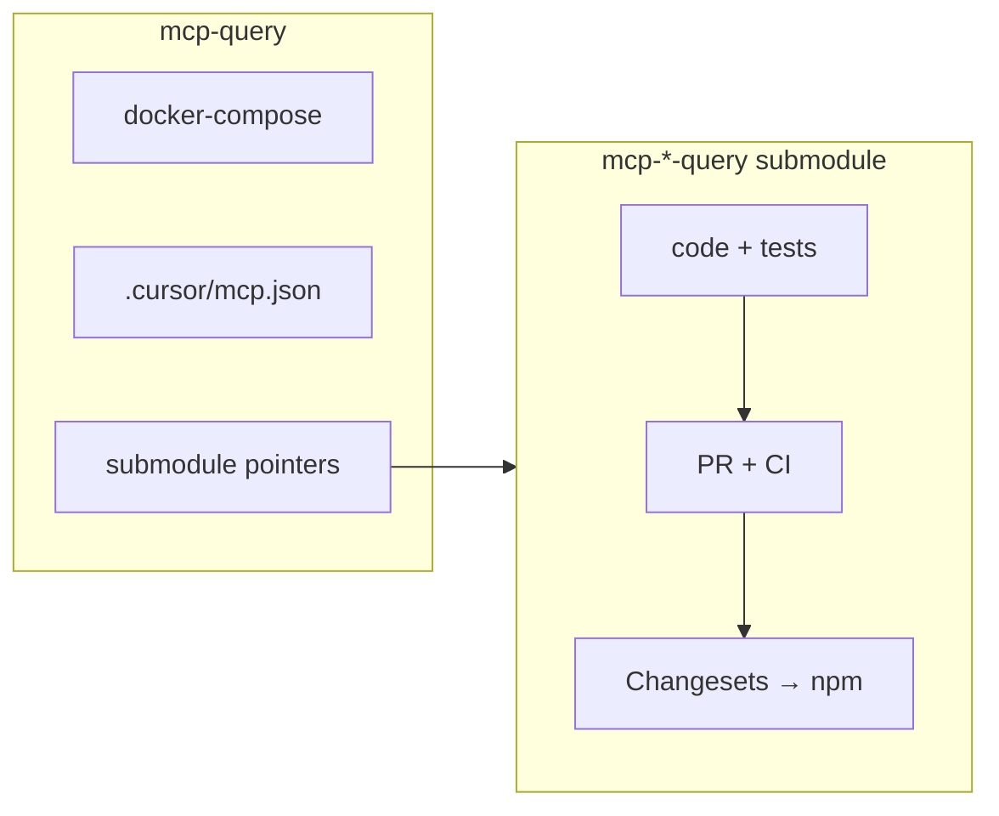

# mcp-query

[](https://github.com/achmadya-dev/mcp-query)

Dev workspace for [@achmadya-dev](https://github.com/achmadya-dev) MCP query servers — **Excel**, **MySQL**, **PostgreSQL**, **SQL Server**, and **SQLite**. Uses git submodules (each package stays its own repo + npm publish), Docker Compose for local databases, and Cursor MCP config via `npx`.

**Repository:** https://github.com/achmadya-dev/mcp-query

## Packages (submodules)

| Submodule | npm | GitHub |
| --- | --- | --- |
| `mcp-excel-query` | `@achmadya-dev/mcp-excel-query` | [achmadya-dev/mcp-excel-query](https://github.com/achmadya-dev/mcp-excel-query) |
| `mcp-mysql-query` | `@achmadya-dev/mcp-mysql-query` | [achmadya-dev/mcp-mysql-query](https://github.com/achmadya-dev/mcp-mysql-query) |
| `mcp-postgres-query` | `@achmadya-dev/mcp-postgres-query` | [achmadya-dev/mcp-postgres-query](https://github.com/achmadya-dev/mcp-postgres-query) |
| `mcp-mssql-query` | `@achmadya-dev/mcp-mssql-query` | [achmadya-dev/mcp-mssql-query](https://github.com/achmadya-dev/mcp-mssql-query) |
| `mcp-sqlite-query` | `@achmadya-dev/mcp-sqlite-query` | [achmadya-dev/mcp-sqlite-query](https://github.com/achmadya-dev/mcp-sqlite-query) |

Shared runtime: [mcp-core](https://github.com/achmadya-dev/mcp-core).

## Layout

```
mcp-query/
├── .gitmodules
├── docker-compose.yml   # local MySQL, Postgres, MSSQL, SQLite
├── .cursor/mcp.json     # npx MCP config (uses .env)
├── data/schema.sql      # SQLite seed schema
├── mcp-excel-query/     → submodule: achmadya-dev/mcp-excel-query
├── mcp-mysql-query/     → submodule: achmadya-dev/mcp-mysql-query
├── mcp-postgres-query/  → submodule: achmadya-dev/mcp-postgres-query
├── mcp-mssql-query/     → submodule: achmadya-dev/mcp-mssql-query
└── mcp-sqlite-query/    → submodule: achmadya-dev/mcp-sqlite-query
```

## Workflow

Two git layers: **this repo** (workspace) and **submodules** (published packages).



| Goal | Where | Commands |
| --- | --- | --- |
| Change package code | inside submodule | `cd mcp-mysql-query` → branch, commit, `gh pr create` |
| Publish to npm | submodule repo | `pnpm changeset` → merge Version packages PR |
| Local DB + MCP test | workspace root | `docker compose up -d`, Cursor reads `.cursor/mcp.json` |
| Pin newer package version | workspace root | `git submodule update --remote` → commit pointer |
| Change compose / MCP config | workspace root | edit root files → commit → `git push origin main` |

### Workspace (parent repo)

```bash
git clone --recurse-submodules git@github.com:achmadya-dev/mcp-query.git
cd mcp-query
cp .env.example .env
docker compose up -d

# pull latest pinned submodules after clone
git submodule update --init --recursive

# refresh all packages to latest main (optional)
git submodule update --remote --merge
git add mcp-excel-query mcp-mysql-query mcp-postgres-query mcp-mssql-query mcp-sqlite-query
git commit -m "chore: bump submodules"
git push origin main
```

### Package (submodule)

```bash
cd mcp-postgres-query
pnpm install && pnpm run build && pnpm test
git checkout -b fix/my-change
git push -u origin fix/my-change
gh pr create --repo achmadya-dev/mcp-postgres-query --base main
```

### Release (Changesets, per submodule)

```bash
cd mcp-mysql-query
pnpm changeset
git add .changeset/*.md && git commit -m "chore: add changeset"
git push origin HEAD
gh pr create --repo achmadya-dev/mcp-mysql-query --base main
# after merge: merge "Version packages" PR → npm publish
```

Install published packages: `npx -y @achmadya-dev/mcp-<name>-query`.

## Develop from source (submodule)

```bash
cd mcp-excel-query   # or any sibling repo
pnpm install
pnpm run build
pnpm test
```

For MCP in Cursor, open the **workspace root** (`mcp-query/`) so `.cursor/mcp.json` and `.env` apply. Published packages are wired via `npx`; for local `dist/` builds see each submodule's README.

## Local databases (Docker)

Start MySQL, PostgreSQL, SQL Server, and SQLite for MCP testing:

```bash
docker compose up -d
# credentials in .env (see .cursor/mcp.json for npx MCP setup)
```

SQLite is initialized from `data/schema.sql` into `data/dev.db`. MCP config lives in `.cursor/mcp.json` (npx + `envFile`).

To remove broken root-owned folders from an old compose mount (optional):

```bash
sudo rm -rf docker/sqlite/data docker/sqlite/init.sql
```
